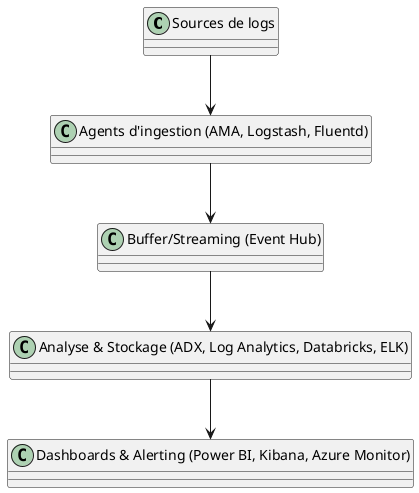
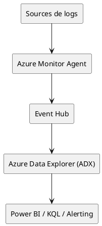
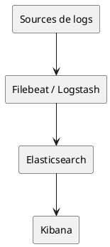
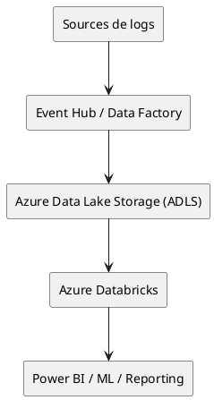

# Step 12 : Schémas d'architecture cible (PlantUML)

## Objectif
Fournir des schémas d'architecture de synthèse (PlantUML ou autre) pour illustrer la solution cible.

## 1. Schéma global de la solution (exemple PlantUML)

## 2. Variantes selon les options

### a) Architecture ADX

### b) Architecture ELK

### c) Architecture Databricks/ADLS

## 3. Légende et explications

- **Sources de logs** : applications, serveurs, appliances réseau
- **Agents d'ingestion** : outils pour collecter et transformer les logs
- **Buffer/Streaming** : absorption des pics, résilience
- **Analyse & Stockage** : moteur d'analyse, stockage hot/cold
- **Dashboards & Alerting** : visualisation, alertes, reporting

---
**Conclusion :**
Ces schémas illustrent les architectures cibles pour chaque solution. Ils peuvent être adaptés et enrichis selon les besoins spécifiques du client et les choix d'intégration.
