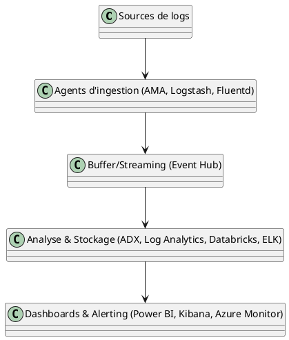
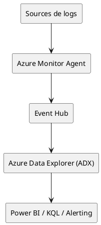
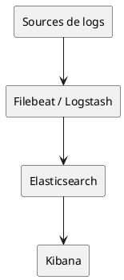
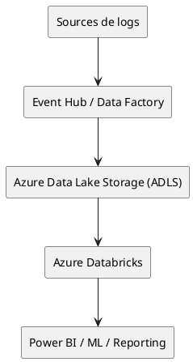

# Table des matières du dossier d'architecture

1. **Step1-ADX-KQL.md** : Focus détaillé sur Azure Data Explorer (ADX) avec KQL
2. **Step2-Comparaison-Cout-ADX-Splunk.md** : Comparaison des coûts ADX vs Splunk
3. **Step3-LogAnalytics-Logs-Chauds.md** : Azure Log Analytics pour logs chauds
4. **Step4-Databricks-ADLS-Logs-Froids.md** : Databricks/ADLS pour logs froids
5. **Step5-Conversion-SPL-KQL.md** : Conversion SPL vers KQL
6. **Step6-ELK-Stack-Azure.md** : ELK Stack sur Azure
7. **Step7-Risques-Migration.md** : Analyse des risques de migration
8. **Step8-Estimation-Financiere.md** : Estimation financière des solutions
9. **Step9-TableauDeBord-Synthese.md** : Tableau de bord synthétique
10. **Step10-Plan-Migration-ADX.md** : Plan de migration ADX
11. **Step11-Outils-Ingestion-Azure.md** : Outils d'ingestion pour Azure
12. **Step12-Schemas-Architecture-PlantUML.md** : Schémas d'architecture cible (PlantUML)

Chaque fichier correspond à une étape clé de l'analyse et de la proposition d'architecture pour la migration de la solution d'analyse de logs.

> Utilisez ce plan pour naviguer et organiser la rédaction de votre dossier d'architecture.

# Step 1 : Focus sur Azure Data Explorer (ADX) avec KQL

## Objectif
Fournir une analyse détaillée d'une solution basée sur Azure Data Explorer (ADX) pour l'analyse de 5 To de logs par jour, en utilisant Kusto Query Language (KQL).

## 1. Présentation d'ADX et de KQL
**Azure Data Explorer (ADX)** est un service d'analyse de données massives (Big Data) en mode PaaS sur Azure, optimisé pour l'ingestion rapide, l'indexation et l'interrogation de très grands volumes de données, notamment des logs, métriques, traces et événements.

**Kusto Query Language (KQL)** est le langage de requête natif d'ADX, conçu pour l'exploration interactive, l'analyse et la visualisation de données structurées et semi-structurées.

**Principales caractéristiques :**
- Ingestion rapide (plusieurs To/heure)
- Indexation automatique et stockage columnar
- Requêtes analytiques puissantes et interactives
- Intégration avec Power BI, Logic Apps, Azure Monitor, etc.

## 2. Architecture type pour ingestion massive
Une architecture ADX pour 5 To/jour s'articule généralement autour des composants suivants :

- **Sources de logs** : applications, serveurs, appliances réseau, etc.
- **Outils d'ingestion** : Azure Data Collector, Event Hub, IoT Hub, Logstash, Azure Data Factory, etc.
- **Cluster ADX** : dimensionné selon le volume, la rétention et la complexité des requêtes.
- **Stockage** : stockage interne ADX (hot) + possibilité d'export vers ADLS (cold/archivage)
- **Accès et analyse** : KQL via portail Azure, API, Power BI, notebooks, etc.

## 3. Scalabilité, performance, sécurité

- **Scalabilité** :
	- ADX supporte le scale-out horizontal (ajout de nœuds) et vertical (puissance des nœuds).
	- Peut gérer des pics d'ingestion et de requêtes analytiques.
- **Performance** :
	- Indexation automatique, partitionnement temporel, cache mémoire.
	- Latence faible pour l'interrogation de données récentes.
- **Sécurité** :
	- Authentification Azure AD, RBAC, chiffrement au repos et en transit.
	- Audit, gestion fine des accès, intégration SIEM.

## 4. Cas d'usage pour l'analyse de logs

- Supervision de SI/SOC (Security Information & Event Management)
- Analyse de logs applicatifs, réseau, infrastructure
- Détection d'anomalies, alerting temps réel
- Reporting réglementaire, conformité
- Exploration ad hoc par les analystes (KQL)

## 5. Avantages et limites

### Avantages
- Solution managée, haute disponibilité native
- Très forte capacité d'ingestion et d'interrogation
- Coût compétitif pour de gros volumes (vs Splunk)
- Langage KQL puissant et documenté
- Intégration avec l'écosystème Azure

### Limites
- Courbe d'apprentissage KQL pour les équipes habituées à SPL
- Nécessite un dimensionnement précis pour optimiser le coût
- Moins adapté à l'archivage long terme (préférer ADLS/Databricks pour le cold)
- Dépendance à l'écosystème Azure

---
**Conclusion :**
Azure Data Explorer (ADX) est une solution robuste, scalable et performante pour l'analyse de très grands volumes de logs, particulièrement adaptée à des besoins de requêtage interactif, d'alerting et de supervision temps réel. Son adoption nécessite un accompagnement à la montée en compétence sur KQL et une réflexion sur l'architecture d'ingestion et de stockage selon les besoins de rétention.

# Step 2 : Comparaison des coûts ADX vs Splunk

## Objectif
Comparer le coût estimé d'un cluster Azure Data Explorer (ADX) traitant 5 To/jour avec les coûts typiques d'une solution Splunk équivalente.

## 1. Méthodologie d'estimation des coûts

L'estimation s'appuie sur :
- Les calculateurs officiels Azure et Splunk
- Les modèles de tarification publics (PaaS pour ADX, licence/consommation pour Splunk)
- Les hypothèses de volume, rétention, et usage

## 2. Hypothèses de dimensionnement

- **Volume de logs** : 5 To/jour (ingestion)
- **Rétention** : 30 jours (hot), 365 jours (cold)
- **Utilisateurs** : 20 analystes, 5 administrateurs
- **Requêtes** : 80% analytiques, 20% alerting
- **Région Azure** : Europe Ouest

## 3. Simulation de coût ADX

| Élément                | Hypothèse                  | Coût mensuel estimé (EUR) |
|------------------------|----------------------------|---------------------------|
| Cluster ADX (D14_v2)   | 2 nœuds, 30 jours, 24/7    | ~7 500 €                  |
| Stockage hot (30j)     | 150 To                     | ~1 500 €                  |
| Stockage cold (ADLS)   | 1,7 Po (365j)              | ~2 000 €                  |
| Réseau, monitoring     | Divers                     | ~500 €                    |
| **Total ADX**          |                            | **~11 500 €**             |

> **Remarque** : Les coûts peuvent varier selon le dimensionnement, la compression, la région et les optimisations d'ingestion.

## 4. Simulation de coût Splunk

| Élément                | Hypothèse                  | Coût mensuel estimé (EUR) |
|------------------------|----------------------------|---------------------------|
| Licence Splunk         | 5 To/jour (ingest)         | ~25 000 €                 |
| Infrastructure         | VM, stockage, support      | ~5 000 €                  |
| Maintenance/Support    | Divers                     | ~2 000 €                  |
| **Total Splunk**       |                            | **~32 000 €**             |

> **Remarque** : Les coûts Splunk sont très sensibles au volume ingéré et à la politique de licence. Les offres cloud Splunk peuvent être plus chères.

## 5. Synthèse comparative

| Solution   | Coût mensuel estimé | Points forts                  | Points faibles                |
|------------|--------------------|-------------------------------|-------------------------------|
| ADX        | ~11 500 €          | Scalabilité, coût, cloud natif| Courbe KQL, dépendance Azure  |
| Splunk     | ~32 000 €          | Maturité, écosystème, support | Coût, scalabilité limitée     |

**Conclusion :**
Azure Data Explorer (ADX) offre un avantage financier significatif pour de très gros volumes de logs, tout en restant performant et flexible. Splunk reste une référence en termes de fonctionnalités, mais son coût devient prohibitif à grande échelle.

# Step 3 : Azure Log Analytics pour logs chauds

## Objectif
Analyser l'intérêt d'Azure Log Analytics pour la gestion des logs chauds (rétention 7-14 jours, alertes temps réel).

## 1. Fonctionnalités principales

- Collecte centralisée de logs, métriques et traces depuis de multiples sources Azure et on-premises
- Analyse en temps réel via KQL (Kusto Query Language)
- Déclenchement d'alertes, automatisation (Logic Apps, Azure Monitor)
- Tableaux de bord interactifs, visualisation intégrée
- Intégration native avec Sentinel (SIEM), Application Insights, ADX

## 2. Architecture d'intégration

L'architecture type pour la gestion des logs chauds avec Log Analytics :

- **Sources** : VM, PaaS Azure, appliances, agents Log Analytics, Event Hub
- **Workspace Log Analytics** : point central de collecte et d'analyse
- **Alerting** : règles d'alerte, actions automatisées
- **Connecteurs** : export vers ADX, Power BI, SIEM, stockage externe

## 3. Scénarios d'usage

- Supervision opérationnelle (infrastructure, applicatif)
- Détection d'incidents et alerting temps réel
- Analyse rapide sur 7-14 jours de logs récents
- Investigation de sécurité (avec Azure Sentinel)

## 4. Limites et complémentarités avec ADX

### Limites
- Coût élevé pour de très gros volumes (>1 To/jour)
- Rétention limitée (max 2 ans, coût croissant)
- Moins adapté à l'analyse massive historique (préférer ADX ou Databricks pour le cold)

### Complémentarités
- Utiliser Log Analytics pour l'ingestion, l'alerting et l'analyse rapide sur logs chauds
- Exporter les données vers ADX pour l'analyse avancée, la rétention longue et l'exploration massive

---
**Conclusion :**
Azure Log Analytics est idéal pour la gestion des logs chauds, l'alerting temps réel et la supervision opérationnelle. Pour des besoins d'analyse massive ou de rétention longue, il est pertinent de le coupler à ADX ou à une solution de stockage/traitement Big Data.

# Step 4 : Databricks/ADLS pour logs froids

## Objectif
Explorer l'utilisation de Databricks et Azure Data Lake Storage (ADLS) pour l'archivage long terme et l'analyse massive de logs froids.

## 1. Architecture cible

- **Sources** : Export de logs depuis ADX, Log Analytics, appliances, applications
- **Stockage** : Azure Data Lake Storage Gen2 (ADLS) pour l'archivage longue durée (plusieurs Po possibles)
- **Traitement** : Azure Databricks (Spark) pour l'analyse batch, l'exploration, le machine learning
- **Accès** : Notebooks Databricks, Power BI, API, jobs automatisés

## 2. Scénarios d'analyse a posteriori

- Recherche d'incidents sur de longues périodes (compliance, forensic)
- Analyses statistiques massives (tendances, corrélations, ML)
- Requêtes ad hoc sur de très grands volumes (logs froids)
- Ré-entraînement de modèles de détection d'anomalies

## 3. Coût et performance

- **Stockage ADLS** : très compétitif pour l'archivage (facturation à la capacité, tiering possible)
- **Databricks** : coût à l'usage (clusters à la demande, auto-pause), dimensionnement selon la volumétrie et la fréquence d'analyse
- **Performance** : très élevée pour le traitement batch/distribué, moins adaptée à l'interactif temps réel

## 4. Complémentarité avec ADX/Log Analytics

- Utiliser ADX/Log Analytics pour l'ingestion, l'alerting, l'analyse rapide sur logs chauds
- Exporter les logs froids vers ADLS pour archivage et analyses massives a posteriori
- Databricks permet d'exploiter la donnée archivée pour des analyses avancées, du ML, ou des besoins réglementaires

---
**Conclusion :**
La combinaison Databricks + ADLS est idéale pour l'archivage long terme et l'analyse massive de logs froids. Elle complète parfaitement ADX/Log Analytics, en offrant une solution scalable, économique et puissante pour l'exploration et la valorisation des données historiques.

# Step 5 : Conversion SPL vers KQL

## Objectif
Examiner la méthodologie de conversion des requêtes Splunk SPL vers KQL pour faciliter la formation des analystes.

## 1. Principales différences SPL/KQL

- **Syntaxe** : SPL (Splunk Processing Language) est orienté pipeline, KQL (Kusto Query Language) est orienté SQL-like avec des opérateurs enchaînés.
- **Fonctions** : Les fonctions d'agrégation, de parsing, de stats et de recherche diffèrent dans leur nommage et leur usage.
- **Gestion du temps** : Les deux langages gèrent le time slicing, mais la syntaxe diffère.
- **Visualisation** : SPL intègre la visualisation, KQL s'appuie sur des outils externes (Power BI, dashboards Azure).

## 2. Outils et guides de conversion

- Documentation officielle Microsoft : [Guide de migration SPL vers KQL](https://learn.microsoft.com/fr-fr/azure/data-explorer/kusto/query/spl)
- Outils communautaires de conversion (scripts Python, plugins VSCode)
- Tableaux de correspondance SPL/KQL (opérateurs, fonctions)

## 3. Exemples concrets

| SPL (Splunk)                                   | KQL (ADX)                                      |
|------------------------------------------------|------------------------------------------------|
| `index=logs error | stats count by host`        | `logs | where error == true | summarize count() by host` |
| `... | timechart span=1h count`                | `... | summarize count() by bin(TimeGenerated, 1h)` |
| `... | top 10 user`                            | `... | summarize count() by user | top 10 by count_` |

## 4. Plan de formation

- Sensibilisation aux concepts KQL (opérateurs, pipes, agrégations)
- Ateliers de conversion de requêtes SPL -> KQL sur des cas réels
- Mise à disposition de guides de correspondance et d'exemples
- Accompagnement sur les outils d'exploration (portail Azure, notebooks, Power BI)

---
**Conclusion :**
La conversion SPL vers KQL nécessite un accompagnement méthodologique et pratique. L'effort de formation est limité pour des analystes déjà familiers avec les requêtes Splunk, grâce à la richesse de la documentation et des outils d'aide à la migration.

# Step 6 : ELK Stack sur Azure

## Objectif
Étudier la faisabilité d'un déploiement ELK Stack (self-managed) sur Azure pour l'analyse de logs à grande échelle.

## 1. Architecture cible sur Azure

- **Ingestion** : Filebeat/Logstash déployés sur VM ou containers pour collecter et transformer les logs
- **Stockage/Indexation** : Cluster Elasticsearch (VMs Azure, AKS ou Azure Managed Elasticsearch)
- **Visualisation** : Kibana (VM, container ou service managé)
- **Sécurité** : Azure Firewall, Private Link, RBAC, chiffrement

## 2. Dimensionnement et coût

- **VMs** : 3-10 nœuds Elasticsearch selon la volumétrie (5 To/jour → 100+ To stockés)
- **Stockage** : Premium SSD/Ultra Disk pour la performance, Azure Blob pour l'archivage
- **Réseau** : Load balancer, VNet, monitoring
- **Coût** :
	- VM (E8s_v4 x 6, 24/7) : ~7 000 €/mois
	- Stockage (100 To SSD) : ~2 000 €/mois
	- Support, maintenance, licences : ~1 000 €/mois
	- **Total estimé** : **~10 000 €/mois** (hors surcharge d'exploitation)

## 3. Avantages et limites

### Avantages
- Contrôle total sur l'infrastructure et la configuration
- Large écosystème open source, plugins, communauté
- Flexibilité d'intégration avec d'autres outils

### Limites
- Complexité d'exploitation, maintenance, upgrades
- Scalabilité manuelle, tuning nécessaire
- Coût caché (exploitation, incidents, support)
- Moins d'intégration native avec Azure que ADX/Log Analytics

## 4. Comparaison avec ADX/Databricks

| Critère         | ELK Stack (Azure)      | ADX/Log Analytics         | Databricks/ADLS         |
|-----------------|-----------------------|--------------------------|-------------------------|
| Coût            | ~10 000 €/mois        | ~11 500 €/mois (ADX)     | Variable, stockage bas  |
| Scalabilité     | Manuelle              | Automatique              | Très élevée (batch)     |
| Maintenance     | À la charge du client | Managée Azure            | Managée (Databricks)    |
| Fonctionnalités | Très riche, plugins   | KQL, alerting natif      | ML, batch, exploration  |

---
**Conclusion :**
Le déploiement d'un ELK Stack sur Azure est pertinent pour les organisations souhaitant garder la main sur leur stack open source, mais il implique une charge d'exploitation et de maintenance importante. Pour des besoins de scalabilité, de simplicité et d'intégration cloud, ADX ou Databricks sont souvent plus adaptés.

# Step 7 : Analyse des risques de migration

## Objectif
Analyser les risques liés à la migration vers ELK ou Azure ADX/KQL.

## 1. Risques techniques

- **Perte de données** lors de la migration des historiques
- **Incompatibilité des formats de logs** ou des schémas
- **Performance dégradée** lors des phases de bascule ou de double run
- **Complexité de la conversion des requêtes** (SPL → KQL, SPL → Elasticsearch DSL)
- **Intégration avec les outils existants** (alerting, dashboards, SIEM)

## 2. Risques organisationnels

- **Courbe d'apprentissage** pour les équipes (KQL, ELK)
- **Changement de processus** et d'outils pour les analystes
- **Gestion du changement** et adhésion des utilisateurs
- **Disponibilité des compétences** (recrutement, formation)

## 3. Risques financiers

- **Sous-estimation des coûts de migration** (projets, licences, consulting)
- **Coûts cachés** liés à l'exploitation, au support, à la formation
- **Dépassement budgétaire** en cas de retard ou de complexité imprévue

## 4. Plans de mitigation

- **Phase pilote** sur un périmètre restreint avant généralisation
- **Tests de migration** et validation de bout en bout (data, requêtes, alertes)
- **Documentation et guides de conversion** pour les requêtes et les processus
- **Formation et accompagnement** des équipes (ateliers, support)
- **Suivi budgétaire** et ajustement du planning selon les retours

---
**Conclusion :**
La migration vers une nouvelle solution d'analyse de logs (ELK ou ADX/KQL) comporte des risques multiples, mais ceux-ci peuvent être fortement réduits par une approche progressive, des tests rigoureux et un accompagnement adapté des équipes.

# Step 8 : Estimation financière des solutions

## Objectif
Estimer le coût global des trois solutions proposées (ADX, ELK, Databricks).

## 1. Hypothèses de calcul

- **Volume de logs** : 5 To/jour
- **Rétention** : 30 jours (hot), 365 jours (cold)
- **Utilisateurs** : 20 analystes, 5 administrateurs
- **Région** : Europe Ouest
- **Support 24/7** inclus

## 2. Estimation détaillée par solution

### Azure Data Explorer (ADX)

| Élément                | Hypothèse                  | Coût mensuel estimé (EUR) |
|------------------------|----------------------------|---------------------------|
| Cluster ADX (D14_v2)   | 2 nœuds, 30 jours, 24/7    | ~7 500 €                  |
| Stockage hot (30j)     | 150 To                     | ~1 500 €                  |
| Stockage cold (ADLS)   | 1,7 Po (365j)              | ~2 000 €                  |
| Réseau, monitoring     | Divers                     | ~500 €                    |
| **Total ADX**          |                            | **~11 500 €**             |

### ELK Stack (self-managed sur Azure)

| Élément                | Hypothèse                  | Coût mensuel estimé (EUR) |
|------------------------|----------------------------|---------------------------|
| VM Elasticsearch       | 6 nœuds E8s_v4, 24/7       | ~7 000 €                  |
| Stockage SSD (100 To)  | Premium SSD                | ~2 000 €                  |
| Support, maintenance   | Divers                     | ~1 000 €                  |
| **Total ELK**          |                            | **~10 000 €**             |

### Databricks + ADLS

| Élément                | Hypothèse                  | Coût mensuel estimé (EUR) |
|------------------------|----------------------------|---------------------------|
| Stockage ADLS (1,7 Po) | Archivage long terme       | ~2 000 €                  |
| Clusters Databricks    | 2 jobs batch/semaine       | ~3 000 €                  |
| Support, monitoring    | Divers                     | ~500 €                    |
| **Total Databricks**   |                            | **~5 500 €**              |

## 3. Synthèse comparative

| Solution   | Coût mensuel estimé | Points forts                  | Points faibles                |
|------------|--------------------|-------------------------------|-------------------------------|
| ADX        | ~11 500 €          | Scalabilité, cloud natif, KQL | Courbe KQL, dépendance Azure  |
| ELK        | ~10 000 €          | Contrôle, open source         | Maintenance, tuning           |
| Databricks | ~5 500 €           | Coût stockage, ML, batch      | Moins interactif, batch only  |

---
**Conclusion :**
Chaque solution présente des avantages et des coûts spécifiques. ADX est optimal pour l'analyse interactive et l'intégration Azure, ELK pour le contrôle open source, Databricks/ADLS pour l'archivage et l'analyse massive à coût optimisé.

# Step 9 : Tableau de bord synthétique

## Objectif
Synthétiser les points clés (coût, risque, architecture) dans un tableau de bord pour la présentation client.

## 1. Tableau comparatif des solutions

| Critère         | ADX                    | ELK Stack              | Databricks/ADLS         |
|-----------------|------------------------|------------------------|-------------------------|
| Coût mensuel    | ~11 500 €              | ~10 000 €              | ~5 500 €                |
| Scalabilité     | Très élevée, managée   | Manuelle, tuning       | Très élevée (batch)     |
| Maintenance     | Managée Azure          | À la charge du client  | Managée (Databricks)    |
| Interactivité   | Temps réel, KQL        | Temps réel, DSL        | Batch, ML, exploration  |
| Sécurité        | Azure AD, RBAC, SIEM   | Custom, plugins        | Azure AD, RBAC          |
| Intégration     | Azure, Power BI, SIEM  | Open source, plugins   | Azure, ML, Power BI     |
| Risques         | Courbe KQL, dépendance | Exploitation, tuning   | Moins interactif        |

## 2. Recommandations

- **ADX** : recommandé pour l'analyse interactive, l'alerting temps réel, l'intégration Azure et la supervision massive.
- **ELK Stack** : pertinent pour les organisations souhaitant garder la main sur leur stack open source, avec une équipe d'exploitation expérimentée.
- **Databricks/ADLS** : idéal pour l'archivage long terme, l'analyse massive a posteriori, le machine learning et la conformité réglementaire.

## 3. Points d'attention

- Bien évaluer la courbe d'apprentissage KQL/SPL/DSL selon les équipes
- Anticiper les coûts cachés (exploitation, support, formation)
- Prévoir une phase pilote et des tests de migration
- Adapter la solution à la volumétrie réelle et aux besoins métiers

---
**Conclusion :**
Le choix de la solution dépendra des priorités (coût, interactivité, contrôle, conformité). Une architecture hybride (ADX pour le chaud, Databricks/ADLS pour le froid) est souvent optimale pour les très gros volumes de logs.

# Step 10 : Plan de migration ADX

## Objectif
Structurer les étapes clés d'un plan de migration vers Azure Data Explorer (ADX).

## 1. Phasage du projet

1. **Cadrage** : analyse des besoins, volumétrie, exigences métiers
2. **Architecture cible** : définition de l'architecture ADX, choix des outils d'ingestion, sécurité
3. **Planification** : découpage en lots, jalons, ressources

## 2. Préparation des données

- Cartographie des sources de logs
- Nettoyage, normalisation et mapping des schémas
- Définition des stratégies de rétention (hot/cold)
- Mise en place des pipelines d'ingestion (Event Hub, Data Factory, etc.)

## 3. Migration des requêtes

- Inventaire des requêtes SPL existantes
- Conversion SPL → KQL (outils, guides, ateliers)
- Tests de performance et d'exactitude sur KQL

## 4. Tests et validation

- Tests d'ingestion (volumétrie, latence)
- Validation des requêtes et des alertes
- Recette fonctionnelle avec les analystes
- Tests de montée en charge

## 5. Formation et conduite du changement

- Sessions de formation KQL pour les analystes
- Documentation des nouveaux processus
- Support et accompagnement post-migration

---
**Conclusion :**
Un plan de migration structuré, itératif et accompagné est essentiel pour garantir le succès du passage à Azure Data Explorer, tout en minimisant les risques et en maximisant l'adoption par les équipes.

# Step 11 : Outils d'ingestion pour Azure

## Objectif
Détailler les outils d'ingestion spécifiques pour remplacer les Universal Forwarders de Splunk dans l'architecture Azure.

## 1. Alternatives Azure aux Universal Forwarders

- **Azure Monitor Agent (AMA)** : agent natif pour collecter logs et métriques sur VM, serveurs, containers
- **Logstash** : pipeline open source, compatible Azure Event Hub, transformation et enrichissement des logs
- **Azure Event Hub** : service de streaming pour ingestion massive, bufferisation et distribution des logs
- **Azure Data Collector API** : ingestion personnalisée via API REST
- **Fluentd/Fluent Bit** : agents open source, support natif Azure, transformation flexible
- **Azure Data Factory** : ingestion batch, orchestration de flux de données

## 2. Architecture d'ingestion type

1. **Sources** : serveurs, applications, appliances réseau
2. **Agents** : AMA, Logstash, Fluentd, etc. déployés sur les sources
3. **Buffer/Streaming** : Event Hub pour absorber les pics et garantir la résilience
4. **Cibles** : Log Analytics, ADX, Data Lake, SIEM

## 3. Bonnes pratiques

- Standardiser les formats de logs (JSON, CEF, Syslog)
- Sécuriser les flux (TLS, authentification, RBAC)
- Superviser l'état des agents et la latence d'ingestion
- Mettre en place des alertes sur les échecs d'ingestion
- Documenter les pipelines et les transformations

---
**Conclusion :**
L'écosystème Azure propose de nombreux outils pour remplacer les Universal Forwarders de Splunk, avec des solutions natives, open source et managées. Le choix dépendra du contexte technique, des volumes et des exigences de sécurité et de supervision.

# Step 12 : Schémas d'architecture cible (PlantUML)

## Objectif
Fournir des schémas d'architecture de synthèse (PlantUML ou autre) pour illustrer la solution cible.

## 1. Schéma global de la solution (exemple PlantUML)

## 2. Variantes selon les options

### a) Architecture ADX

### b) Architecture ELK

### c) Architecture Databricks/ADLS

## 3. Légende et explications

- **Sources de logs** : applications, serveurs, appliances réseau
- **Agents d'ingestion** : outils pour collecter et transformer les logs
- **Buffer/Streaming** : absorption des pics, résilience
- **Analyse & Stockage** : moteur d'analyse, stockage hot/cold
- **Dashboards & Alerting** : visualisation, alertes, reporting

---
**Conclusion :**
Ces schémas illustrent les architectures cibles pour chaque solution. Ils peuvent être adaptés et enrichis selon les besoins spécifiques du client et les choix d'intégration.
